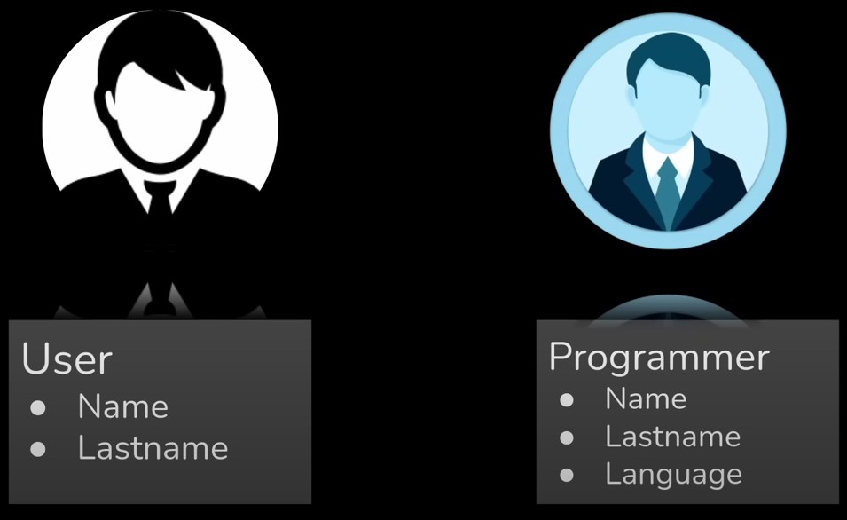
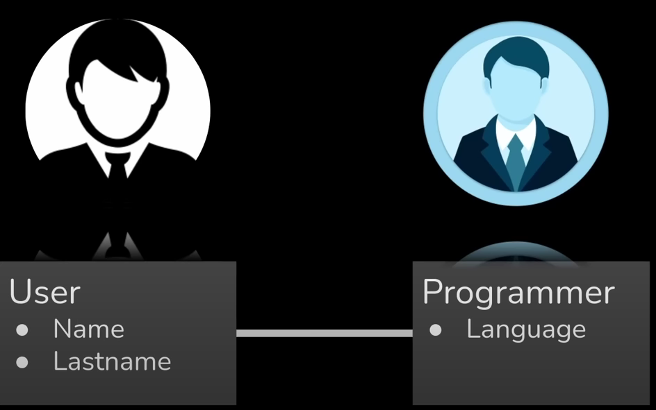
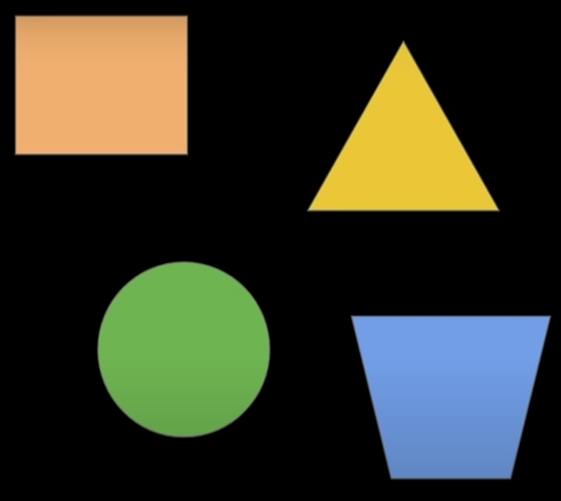

# Principios POO

Serie de pautas o caracteristicas que un lenguaje debe de cumplir para considerarse ser orientado a objetos.

- Escribir código que sea modular y que sea reutilizable (forma en la que podemos dividir una app grande en pequeñas partes y cada una de estas partes tiene un proposito, un objetivo cada una de estas partes se pueden reutilizar evitando crearlas una y otra vez)
- No existe ninguna especificación o documetno tecnico que diga que es orientado a objetos o no.
- Se basa en el sentido común por parte de investigadores o personas que han diseñado sistemas que han acordado una serie de principios que los lenguajes de programación deberían de tener para que puedan ser considerados orientados a objetos
- http://wiki.c2.com/?DefinitionsForOo

Como minimo 2 características deben de tener los lenguajes con POO

- Capacidad de modelar problemas a través de objetos
- Soporte de algunos principios que garanticen la modularidad y reusabilidad del códgio

## Capacidad de modelar problemas a través de objetos

- Asociación: objetos con la capacidad de referir a otro objeto. Es decir poder unir dos objetos y poder enlazarlos de cierta forma en código

- Agregación: capacidad de un objeto de referir a otros objetos independientes. Es decir podemos tener un objeto grande en el que puede estar formado por objetos más pequeños pero si extraemos un objeto pequeño de uno grande este objeto pequeño aun puede ser utilizado en otro código (objeto independiente)

- Composición: capacidad de un objeto de referir a otros objetos dependientes. Es decir un objeto grande que esta formado por multiples objetos pequeños pero si sacamos un objeto pequeño del grande el grande ya no seriviria o funcionaria correctamente.

## Soporte de algunos principios que garanticen la modularidad y reusabilidad del códgio

- Encapsulación: capacidad de concentrar datos y código en una sola entidad ocultando sus detalles internos. (private, public, protected) 
- Herencia: mecanismo por el que un objeto puede adquirir algunas o todas las cáracteristicas de uno o más objetos.
- Polimorfismo: capacidad de procesar objetos con diferentes tipos de datos y distintas estructuras pero devolver una respuesta 

Si el lenguaje cumple con todas estas cáracteristicas se puede considerar orientado a objetos.

## ¿Es javascript orientado a objetos?

- palabra clave class
- no nos fuerza a complir la POO (podemos modificar las variables por lo que podemos usar paradigmas funcionales, imperativos o poo)
- Los principios son requeridos para la poo pero las clases no
- las clases no son requeridas para ningun lenguaje para que pueda ser poo sin embargo si es una forma conveniente para poder extraer un objeto con algunas propiedades y métodos para que sean fácilmente entendibles para un programador 
- un lenguaje puede ser orientado a objetos incluso sin incluir clases como javascript

## Modelar a través de objetos

Cuando escribimos código, modelamos a través de estas entidades para poder simplificar la realidad (**abstracción**) no necesariamente tenemos que conocer todos los detalles internos de un objeto para poder utilizarlo de hecho esto lo vemos a diaro cuando utilizamos un telefono o un coche o incluso código cuando programos una ventana no tenemos que preocuparnos de poder diseár pixel a pixel una ventana simplemente llamamos a un método que sea mostrar ventana y este ya muestra una ventana para que podamos hacer lo que queramos allí.

Utilizamos la abstracción para solucionar problemas grandes que pueden llegar a ser tediosos y complicados pero a pesar de todo esto podemos escribirlos y leerlos de una forma sencilla

## Encapsulación

Consiste en simplificar el uso de un objeto, el usuario no tiene que saber como funciona internamente, el solo debe saber que funciona.

En el momento de escribir código ayuda a simplificar cambios porque el usuario cuando llama a un método el siempre va a recibir una respuest en base a unos parametros que el pase, pero no tiene que aprender como funciona internamente.

Tenemos 

## Herencia

Es un principio en el que nos permite crear objetos especializados a partir de uno más generico.

En este ejemplo se muestra como 2 objetos uno usuario y otro programador en algun momento lo vamos a empezar a describir cada uno con sus 
propiedades podríamos decir decir que usuario tiene las propiedades nombre y apellido y luego podemos decir que programador tiene las propiedades 
nombre, apellido y lenguaje el lenguaje es porque el programador debe de conocer un lenguaje de programación para ser un programador.

Si nos damos cuenta ambos objetos a pesar de ser distintos tienen propiedades similares en concreto las propiedades nombre y apellido.

Por esta razón existe la herencia en lugar de repetir un código en un objeto nuevo lo que podriamos hacer que el objeto programador herede de usuario. Reutilizando las propiedades de usuario más las propiedades nuevas que queramos implementar en la clase de programador. 

## Polimorfismo

Es la capacidad que tienen algunos objetos para poder manipular distintos tipos de datos de manera uniforme.

Algunos de los beneficios del polimorfismo son:

- reducir el acoplamiento de nuestra aplicación (cuando nosotros ejecutamos un método de un objeto este puede depender de otros métodos de otros objetos heredados, para poder reducir esta complejidad podemos utilizar polimorfismo)
- aveces nos permite escribir código más compacto, incluso más entendible 
- soporte de polimorfismo: 
    - Sobrecarga: Consiste en que los métodos pueden coger parametros con diferentes tipos de datos y al final poder procesarlos sin ningun problema
    - Polimorfismo parametrizado: Consiste en que nos permite manejar distintos tipos de datos genericos, es decir podemos pasarle cualquier objeto con cualquier estructura sin conocerla en detalle y aun así el método puede procesarlo
    Subtipo de polimorfismo o polimorfismo inclusivo: Consiste en representar una clase que viene derivada de otra y aun así poder procesarla.

