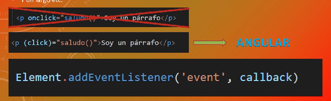

# Eventos

Un evento es cualquier cosa que sucede en nuestro documento.
- El contenido se ha leído
- El contenido se ha cargado
- El usuario mueve el ratón
- El usuario pulsa una tecla
- La ventana se ha cerrado
- Y un lago etc.

[Enlace a la MDN](https://developer.mozilla.org/es/docs/Web/Events  "Enlace a la MDN")

Antiguamente se escribiar JavaScript en HTML para hacer los eventos esta forma no se recomienda para nada
porque no es escalable ni sostenible en el tiempo.
En algunos casos nos podemos encontrar una sintaxis similar en angular en este caso si esta bien porque
se trabaja con componentes.

Para crear un evento lo haremos con la siguiente sintaxis: elemento al que queremos aplicar el evento
añadimos un addEventListener con la nomenclatura del punto . y en el parentesis ('event', callback) event
es el nombre del evento al que hacemos referencia y el callback es una función que vamos a ejecutar cuando
se dispare el evento.

