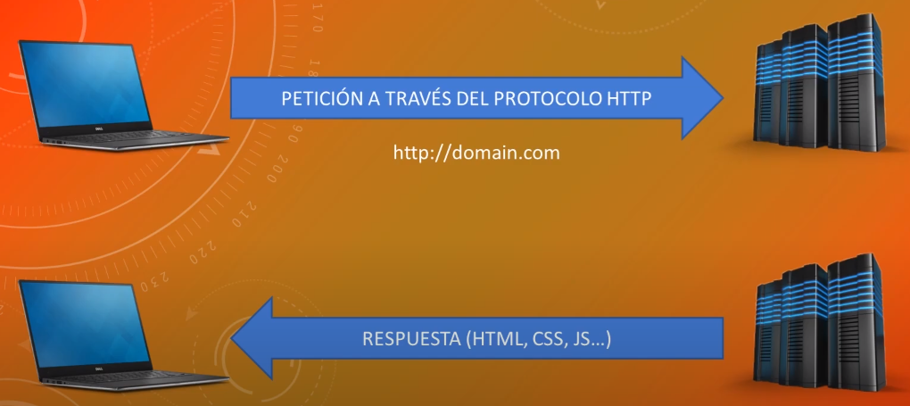
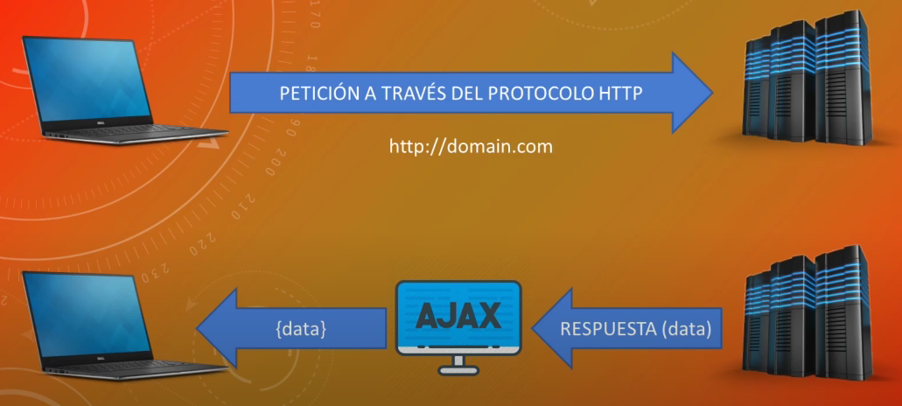

# AJAX 

## CÓMO FUNCIONA LA WEB

Nosotros cuando hacemos una petición a un dominio siempre utilizamos el protocolo HTTP 
cuando escribimos la dirección en la barra de direcciones estamos solicitando a un servidor
cierta información y entonces ese servidor lo que hace es devolvernos lo que nosotros 
denominamos la página web que esta compuesta por HTML, CSS, JavaScript, imágenes, audio, video etc.  

Cuando nosotros utilizamos AJAX lo que estamos haciendo es interceptar la respuesta para evitar
que la página se recarge de esta forma nosotros lo que hacemos en lugar de solicitar todos los
datos es decir todo el html, css, javascript, audio, video la información que sea pues no lo 
hacemos así nosotros hacemos la petición igualmente por el protocolo HTTP pero solo solicitamos
ciertos datos y esos datos cuando llegan los guardamos en un objeto entonces de esa forma
obtenemos los datos del servidor pero no recargamos la página porque no estamos cargando esos
datos en el navegador los tenemos en un objeto y una vez trabajamos con ese objeto de la forma
que necesitemos hay veces que ni siquiera tenemos que hacer nada en la página y que el usuario
se de cuenta esto es algo que puede suceder de forma completamente transparente al usuario no
es lo habitual pero puede pasar. Esto es un resumen de AJAX es mucho más complejo pero con esto
ya podemos trabajar con el en JavaScript.

AJAX es asíncrono. Normalmente cuando hacemos una petición y esperamos una respuesta el 
navegador se queda cargando y hasta que no hemos recibido todos los datos no carga la página 
Entonces con AJAX lo que conseguimos es que se carge la página y todos los datos que hagamos 
peticiones al servidor llegan más tarde estos datos no estan sincronizados con la página cargan
cuando el servidor nos devuelva la información. **La página va por un lado y la petición y los 
datos van por otro entonces aunque los datos no hayan llegado la página sigue funcionando.**

