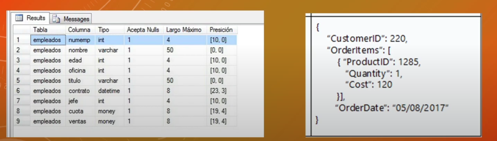

# IndexedDB 

- Es una manera de almacenar datos de manera persistente en el navegador.
- Almacena pares de clave-valor. Los valores pueden ser objetos con estructuras complejas, y la API de IndexedDB es mayormente asíncrona.
- IndexedDB usa eventos DOM para notificar cuando los resultados están disponibles.
- IndexedDB es orientada a objetos.

- La diferencia entre localStorage y indexedDB es que localstorage sirve para almacenar porciones muy pequeñas de datos por ejemplo un nombre de usuario o un email y en indexedDB podemos guardar una gran cantidad de datos es decir un perfil de usuario completo por ejemplo: nombre, contraseña, imagen de perfil, a lo que ha dado a favoritos etc.

Ejemplo de una base de datos relacional y otra base de datos basada en objetos

## Creación 

- Crear la base de datos a través del objeto indexedDB y el método open()

- Comprobar si la base de datos existe o tiene que ser creada a través del método onupgradeneeded()

- Crear almacén de objetos con el método createObejctStore()

- Escuchar los eventos de éxito y de error con los métodos onsucces() y onerror()

